# Práctica Final Docker

## TesloShop – Aplicación Contenerizada

Este proyecto implementa una arquitectura **end-to-end contenerizada** utilizando **Docker** y **Docker Compose**.

La aplicación está compuesta por tres servicios principales:

* **Frontend:** Aplicación Angular servida con Nginx
* **Backend:** API REST desarrollada en NestJS
* **Base de datos:** PostgreSQL

Todos los servicios se comunican a través de una red interna de Docker:
**`teslo-network`**

---

## Tecnologías utilizadas

* Docker & Docker Compose
* Node.js (NestJS)
* Angular
* Nginx
* PostgreSQL

---

## Pasos de ejecución

Sigue estos pasos para levantar el proyecto correctamente:

### 1. Clonar el repositorio

```bash
git clone "url del repositorio"
cd practica-docker-final
```

### 2. Configurar variables de entorno

Editar el archivo `.env`:

```env
POSTGRES_PASSWORD=tu_password
DB_PASSWORD=tu_password
JWT_SECRET=una_clave_segura
```

---

### 3. Dar permisos a los scripts

```bash
chmod +x start.sh stop.sh
```

---

### 4. Ejecutar la aplicación

#### Opción 1: Usando script

```bash
./start.sh
```

#### Opción 2: Directamente con Docker

```bash
docker compose up --build -d
```

Verificar servicios:

```bash
docker compose ps
```

Deberías ver:

* `teslo-db` → running (healthy)
* `teslo-backend` → running
* `teslo-frontend` → running

---

## Acceso a la aplicación

* Frontend: [http://localhost](http://localhost)
* Backend API: [http://localhost:3000/api](http://localhost:3000/api)
* Swagger: [http://localhost:3000/api/docs](http://localhost:3000/api/docs)

---

## Seeder (Datos de prueba)

Ejecuta:

```
http://localhost:3000/api/seed
```

Esto cargará productos y usuarios de prueba en la base de datos.

---

## Explicación de servicios

### Base de datos (PostgreSQL)

* Imagen oficial: `postgres:14.3`
* Usa volumen persistente: `postgres-data`
* Configurada mediante variables de entorno
* Incluye **healthcheck** para asegurar disponibilidad

---

### Backend (NestJS)

* Construido con **Docker multi-stage**
* Modos:

  * `dev`: hot-reload (desarrollo)
  * `prod`: optimizado para producción

#### Funcionalidades:

* API REST
* Conexión a PostgreSQL
* Autenticación con JWT
* Endpoint `/api/seed`

Puerto:

```
http://localhost:3000
```

---

### Frontend (Angular + Nginx)

* Angular compilado en etapa **build**
* Servido con **Nginx** en producción

#### Nginx se encarga de:

* Servir la SPA
* Manejar rutas (SPA routing)
* Cachear archivos estáticos
* Proxy hacia el backend (`/api`)

Puerto:

```
http://localhost
```

---

## Docker Compose

El archivo `docker-compose.yml` orquesta:

* Creación de contenedores
* Red interna (`teslo-network`)
* Volúmenes persistentes
* Dependencias entre servicios

### Servicios definidos:

* `db` → PostgreSQL
* `backend` → NestJS
* `frontend` → Angular + Nginx

---

## Scripts

### start.sh

* Verifica que Docker esté activo
* Construye las imágenes
* Levanta los contenedores

```bash
./start.sh
```

---

### stop.sh

* Detiene todos los servicios

```bash
./stop.sh
```

---

## Reiniciar completamente el entorno

```bash
docker compose down -v
docker compose up --build -d
```

---

## Evidencias / Capturas

## 📸 Funcionamiento del sistema

<p align="left">
  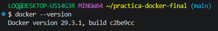
  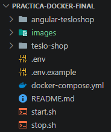
 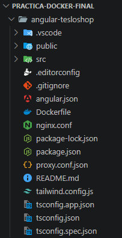
  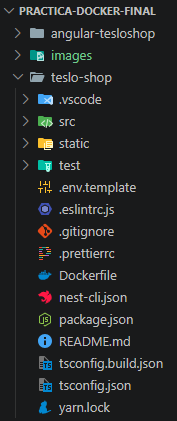
 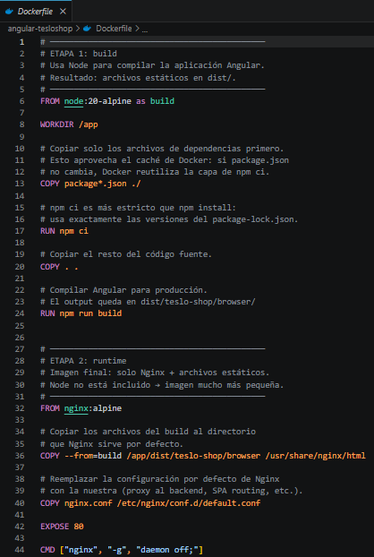
  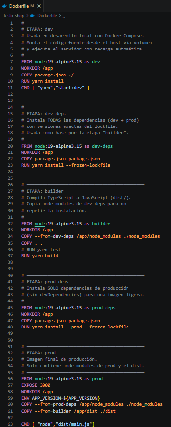
 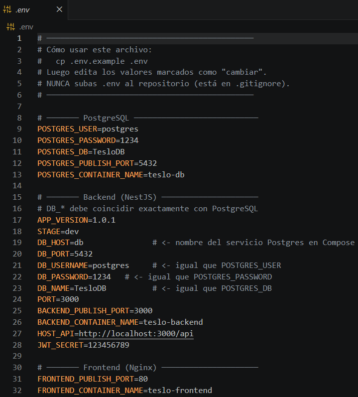
  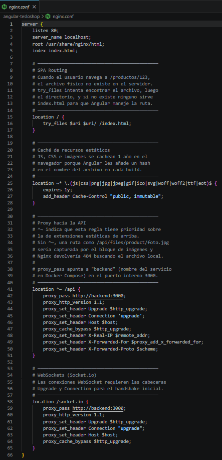
 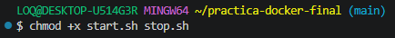
  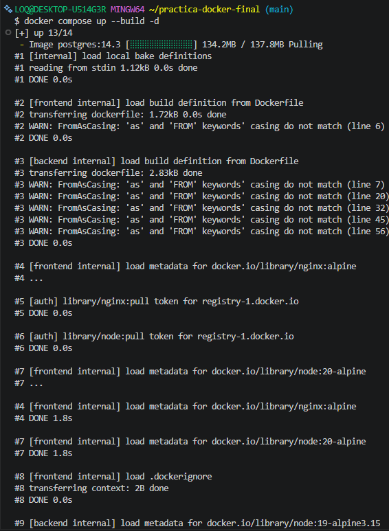
  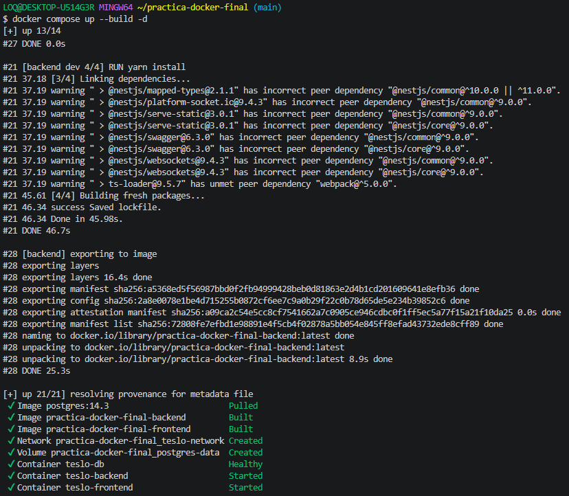
  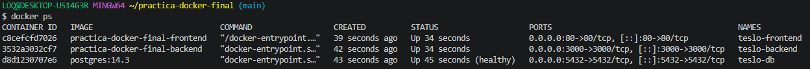
  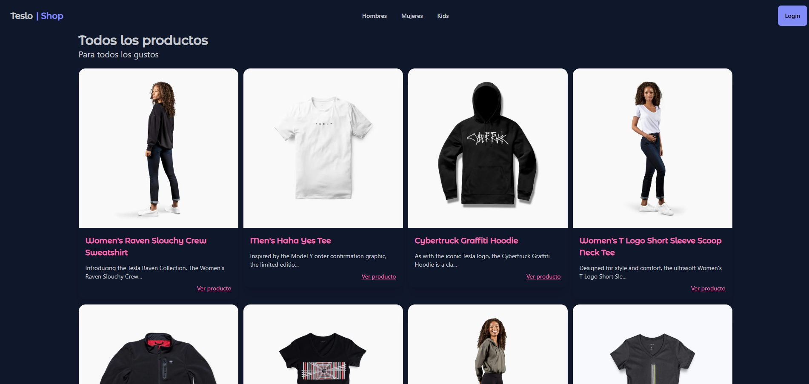
  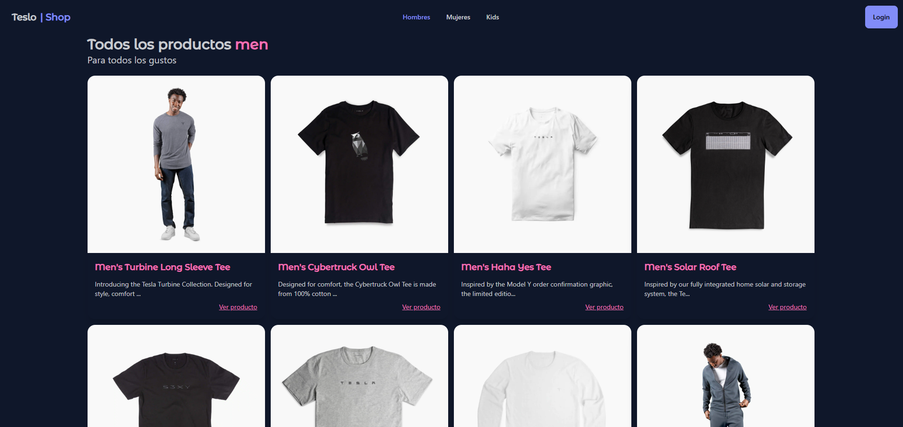
  
  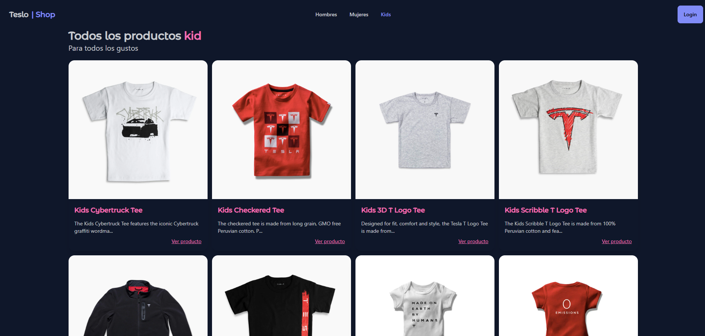
  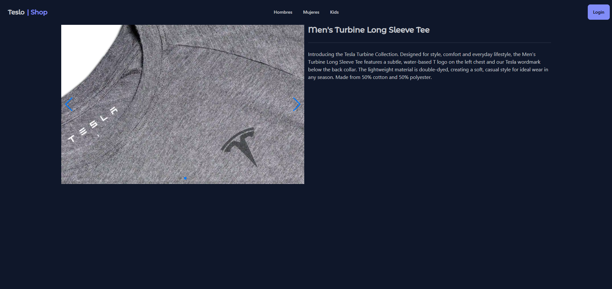
</p>

---

### Enlace al video de YT:

https://youtu.be/iIXB3rRVFeI
